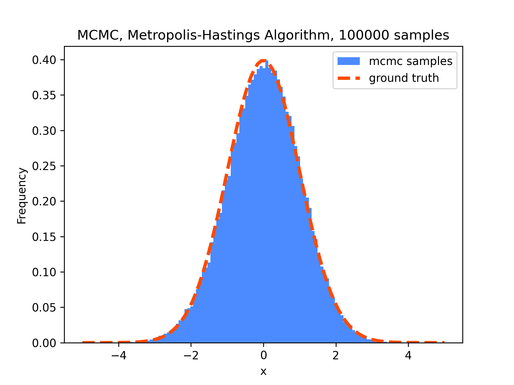
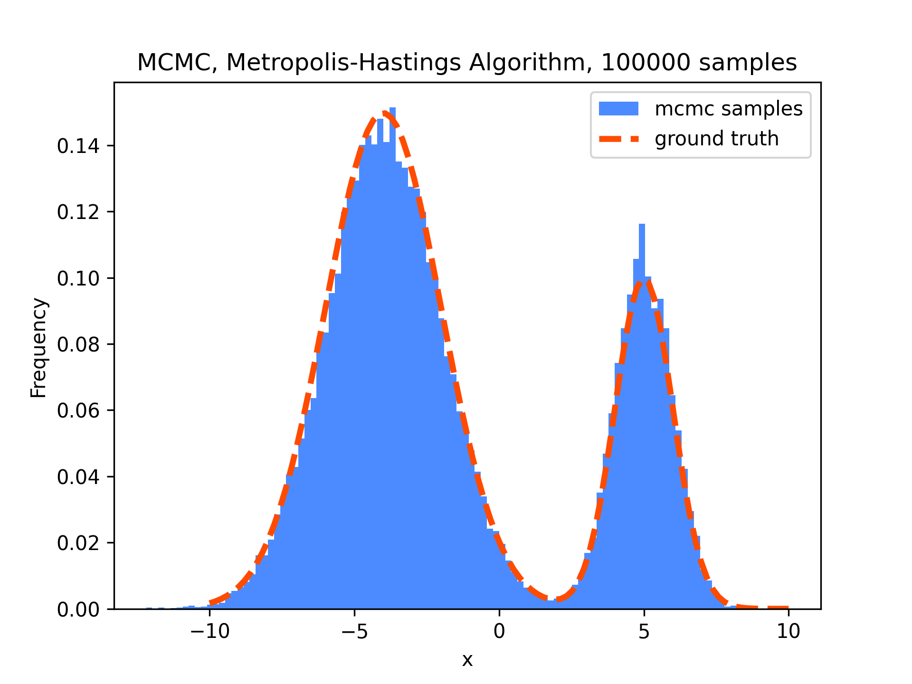

[](https://opensource.org/licenses/MIT)
[](https://rye.astral.sh)

# Markov Chain Monte Carlo (MCMC)

## Dependency

- [python](https://www.python.org/)
  - version 3.10 or higher is recommended.

- [rye](https://rye.astral.sh/)
  - seting up python environment easily and safely.
  - only `numpy`, `matplotlib`, `notebook` are needed to run all scripts in this repository.

## Setup
```sh
git clone https://github.com/MizuhoAOKI/mcmc.git
cd mcmc
rye sync
```

## Usage

### Sampling from Arbitrary Probability Distributions 
```sh
cd mcmc
rye run jupyter notebook notebooks/mcmc_1d.ipynb
```

Unimodal Distribution 


Multimodal Distribution
